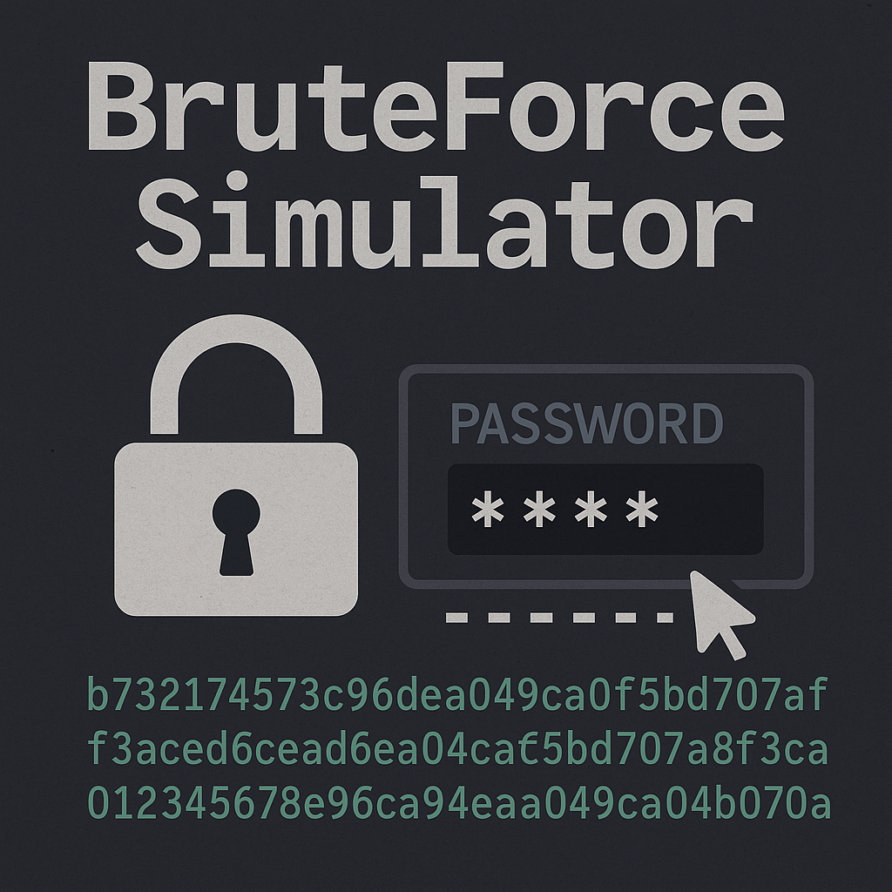

# Brute Force Attack Simulator

A simple Java program that simulates a brute force attack to crack a hashed password using SHA-256.  
It tries all possible combinations of characters up to a specified maximum length and reports the cracked password (if found), the number of attempts, and the time taken.

---

## Features

- Takes a cleartext password input from the user.
- Hashes the password with SHA-256.
- Allows the user to specify the maximum length of the password guesses.
- Displays the total possible combinations before starting.
- Prompts the user for confirmation before starting the brute force process.
- Outputs the cracked password, number of attempts, and elapsed time upon success or failure.

---

## Requirements

- Java 11 or higher
- Maven (for build and dependency management)

---

## How to Use

1. Clone or download the repository.

2. Compile and run from a terminal.

```bash
cd /path/to/repo-folder
mvn clean package
java -jar target/BruteForceSimulator-1.0-SNAPSHOT.jar
